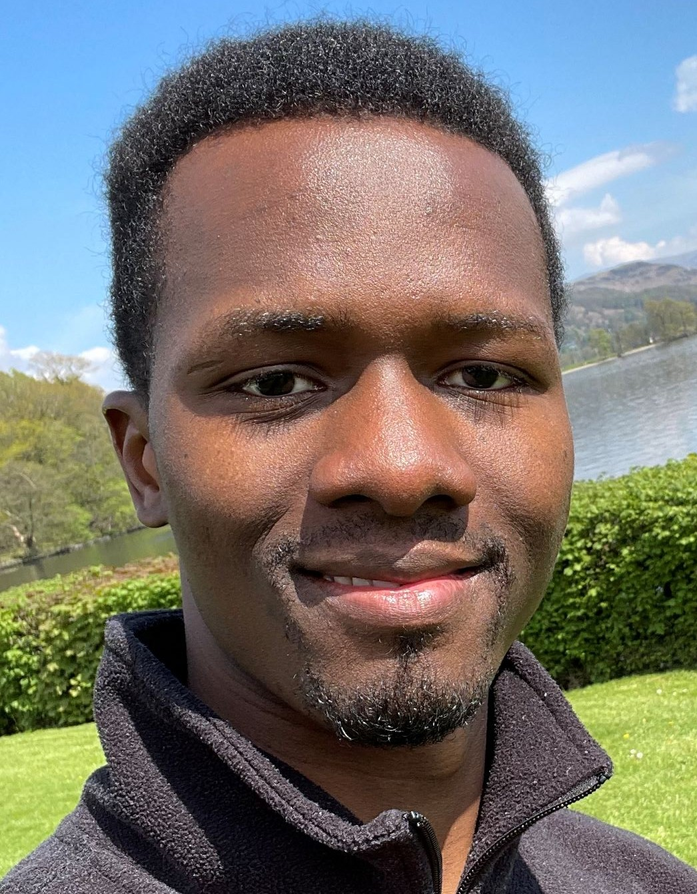

I am a **Royal Society Research Fellow** in the [Mackinder Lab](https://mackinderlab.weebly.com/), investigating the resilience of photosynthetic organisms to environmental challenges. My research focuses on understanding how microalgae adapt to oxygen-rich environments, with a particular emphasis on **photorespiration**. Using an integrative approach that combines **physiology, molecular biology, genetics, and biochemistry**, I aim to uncover the mechanisms that allow these organisms to optimize photosynthetic efficiency under fluctuating environmental conditions.  

Learn more about my [Royal Society Career Development Fellowship](https://royalsociety.org/news/2025/10/career-development-fellowship-cohort-2/)..

I have authored publications in leading journals including **Nature**, **Nature Communications**, **Plant Physiology**, and others, and I am recognized for my expertise in **algal physiology**. My work has been honored with **several scientific awards**.

[📄 Download My CV (PDF)](/assets/files/Ousmane_Dao_CV.pdf)

---

## Key Publications

- **O. Dao et al.**, *Nature Communications*, 2025.  
  https://doi.org/10.1038/s41467-025-60525-7  

- **O. Dao et al.**, *Plant Physiology*, 2024.  
  https://doi.org/10.1093/plphys/kiae617    
  
- **A. Burlacot, O. Dao et al.**, *Nature*, 2022.  
  https://doi.org/10.1038/s41586-022-04662-9
  
- **O. Dao et al.**, *Trends in Plant Science*, 2021.  
  https://doi.org/10.1016/j.tplants.2021.11.007    

---

